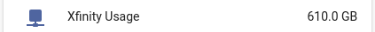
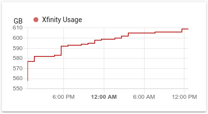

# xfinity-usage

Custom component for Home Assistant allowing retrieval of data usage
from [Xfinity My Account website](https://login.xfinity.com). 

**NOTE**: The My Account website may require manual intervention at some point
to allow the component to function properly. Meaning, you may need to click "Agree"
on a prompt after logging in through your browser. _This has happened once a year._

## Installation

### With HACS
1. Open HACS Settings and add this repository (https://github.com/robert-alfaro/xfinity-usage)
as a Custom Repository (use **Integration** as the category).
2. The `Xfinity Usage` page should automatically load (or find it in the HACS Store)
3. Click `Install`

### Manual
Copy the `xfinity_usage` directory from `custom_components` in this repository,
and place inside your Home Assistant installation's `custom_components` directory.


## Setup
1. Install this component
2. Add the following to your `configuration.yaml` 

```yaml
sensor:
  - platform: xfinity
    username: !secret xfinity_email
    password: !secret xfinity_password
```

Here are two lovelace examples:

```yaml
type: entities
entities:
  - entity: sensor.xfinity_usage
```



```yaml
type: history-graph
entities:
  - entity: sensor.xfinity_usage
hours_to_show: 24
refresh_interval: 3600
```

